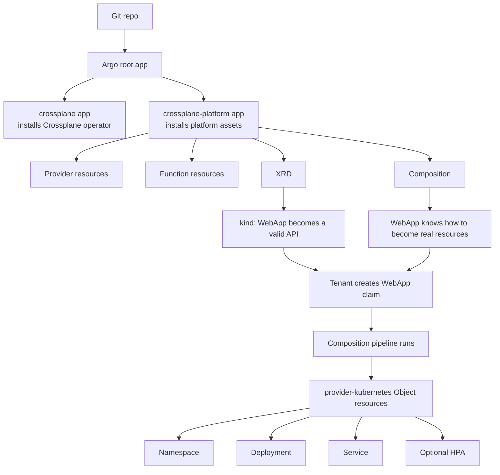
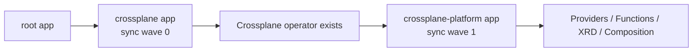
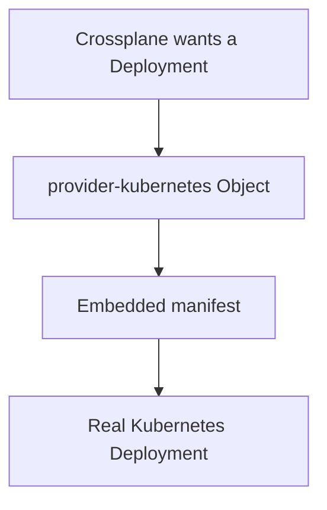
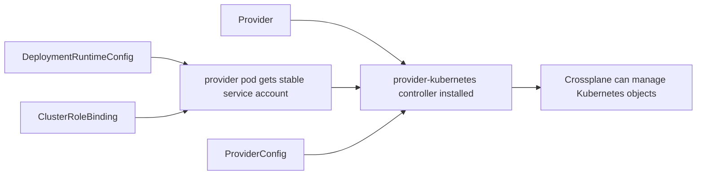
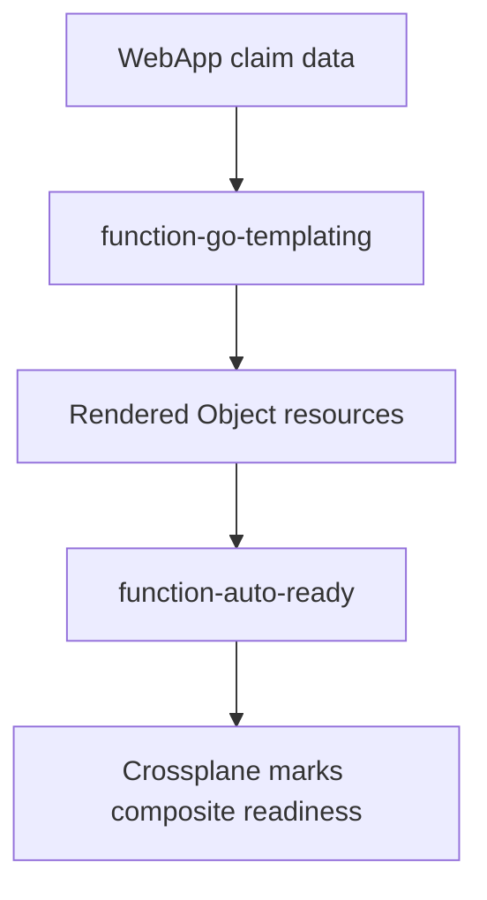
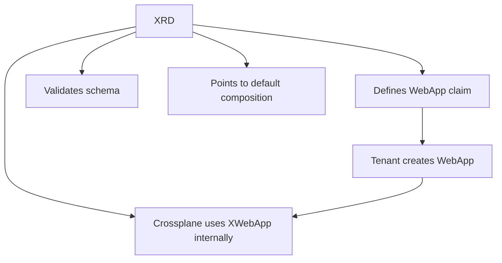
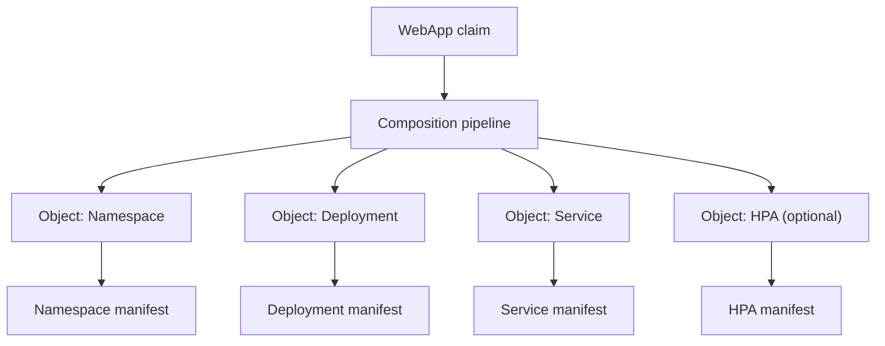
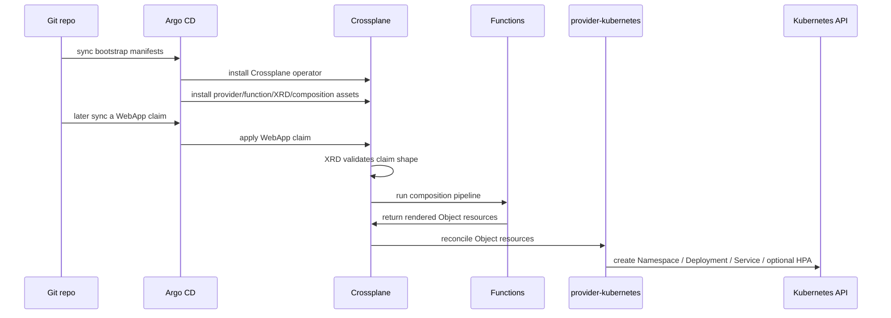
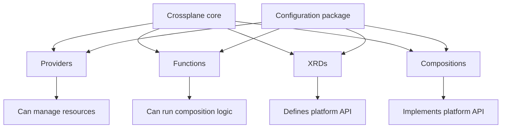

# Crossplane Resources Explained

This note explains the Crossplane resources added for the first `WebApp` platform API in beginner-friendly terms.

The main question it answers is:

What new machinery did we add so a future `WebApp` claim can become a real running app?

The answer is:

- we added the delivery path
- we added the execution engine
- we added the platform API
- we added the implementation behind that API

## The Whole System First

Here is the full shape before we zoom into each file:



There are four layers here:

1. Argo CD delivery
2. Crossplane packages and permissions
3. The `WebApp` API definition
4. The implementation of that API

Now let’s walk them one by one.

## 1. The Argo Delivery Layer

Files:

- [crossplane-application.yaml](/Users/riza.satyabudhi/Documents/workshop/claude/homelab/homelab-infra/clusters/homelab/bootstrap/crossplane-application.yaml)
- [crossplane-platform-application.yaml](/Users/riza.satyabudhi/Documents/workshop/claude/homelab/homelab-infra/clusters/homelab/bootstrap/crossplane-platform-application.yaml)

These are Argo CD resources, not Crossplane resources.

They exist because Crossplane needs to get its own manifests from Git into the cluster, just like anything else.

What each one does:

- `crossplane-application.yaml`
  - installs the Crossplane operator itself from the Helm chart
  - think of this as "install Crossplane the software"
- `crossplane-platform-application.yaml`
  - syncs the Crossplane platform assets from your repo
  - specifically:
    - `providers/`
    - `functions/`
    - `xrds/`
    - `compositions/`
  - think of this as "install the things Crossplane should use"

This split matters because:

- the operator install is infrastructure plumbing
- the platform assets are your product logic

That means you can change the `WebApp` API later without mixing it into the Helm install definition.

We also added sync waves so Argo brings up the operator before the platform assets.

That ordering looks like this:



If you are brand new to this, the takeaway is:
Argo is just the delivery truck. It gets Crossplane and Crossplane assets into the cluster.

## 2. The Provider Layer

Files:

- [deployment-runtime-config.yaml](/Users/riza.satyabudhi/Documents/workshop/claude/homelab/homelab-infra/platform/control-plane/crossplane/providers/deployment-runtime-config.yaml)
- [provider-kubernetes-clusterrolebinding.yaml](/Users/riza.satyabudhi/Documents/workshop/claude/homelab/homelab-infra/platform/control-plane/crossplane/providers/provider-kubernetes-clusterrolebinding.yaml)
- [provider-kubernetes.yaml](/Users/riza.satyabudhi/Documents/workshop/claude/homelab/homelab-infra/platform/control-plane/crossplane/providers/provider-kubernetes.yaml)
- [provider-kubernetes-config.yaml](/Users/riza.satyabudhi/Documents/workshop/claude/homelab/homelab-infra/platform/control-plane/crossplane/providers/provider-kubernetes-config.yaml)

This is the part that usually feels most confusing at first.

The simplest explanation is:

Crossplane is an orchestrator.
A provider is what gives Crossplane hands.

In this repo, we want Crossplane to create normal Kubernetes resources like:

- `Namespace`
- `Deployment`
- `Service`
- `HorizontalPodAutoscaler`

So we install `provider-kubernetes`.

That provider is the thing that knows how to manage ordinary Kubernetes objects on Crossplane’s behalf.

### 2.1 `Provider`

File: [provider-kubernetes.yaml](/Users/riza.satyabudhi/Documents/workshop/claude/homelab/homelab-infra/platform/control-plane/crossplane/providers/provider-kubernetes.yaml)

This installs the `provider-kubernetes` package.

What it means in practice:

- Crossplane downloads and runs a controller for Kubernetes resources
- after that, Crossplane has a resource type called `Object` available through that provider

That `Object` type is extremely important.
It is the wrapper Crossplane uses to manage arbitrary Kubernetes YAML.

Think of it like this:



So the provider is not "the deployment template."
It is the runtime adapter.

### 2.2 `DeploymentRuntimeConfig`

File: [deployment-runtime-config.yaml](/Users/riza.satyabudhi/Documents/workshop/claude/homelab/homelab-infra/platform/control-plane/crossplane/providers/deployment-runtime-config.yaml)

This gives the provider pod a stable service account name: `provider-kubernetes`.

Why we need that:

- the provider runs as a pod
- the pod needs a Kubernetes identity
- we want that identity name to be predictable
- predictable identities make RBAC manageable

Without this, the provider’s runtime identity is harder to wire cleanly.

So this file is basically:
"Run the provider pod using a known service account."

### 2.3 `ClusterRoleBinding`

File: [provider-kubernetes-clusterrolebinding.yaml](/Users/riza.satyabudhi/Documents/workshop/claude/homelab/homelab-infra/platform/control-plane/crossplane/providers/provider-kubernetes-clusterrolebinding.yaml)

This binds that service account to `cluster-admin`.

That is broad, and we should treat it as intentionally broad for a first cut.

Why it exists:

- the provider needs permission to create namespaces and workloads
- without permission, Crossplane could want to create resources but still fail

In plain terms:
this is the permission slip for the provider’s hands.

### 2.4 `ProviderConfig`

File: [provider-kubernetes-config.yaml](/Users/riza.satyabudhi/Documents/workshop/claude/homelab/homelab-infra/platform/control-plane/crossplane/providers/provider-kubernetes-config.yaml)

Installing a provider package is not enough.
The provider also needs to know how to authenticate.

That’s what `ProviderConfig` does.

In this case:

- it is named `default`
- it uses `InjectedIdentity`

That means:
use the in-cluster identity of the provider pod itself.

So the full provider picture is:



If you remember only one thing from this section, let it be this:

Provider resources are what turn Crossplane from "an API brain" into "something that can actually create Kubernetes objects."

## 3. The Function Layer

Files:

- [function-go-templating.yaml](/Users/riza.satyabudhi/Documents/workshop/claude/homelab/homelab-infra/platform/control-plane/crossplane/functions/function-go-templating.yaml)
- [function-auto-ready.yaml](/Users/riza.satyabudhi/Documents/workshop/claude/homelab/homelab-infra/platform/control-plane/crossplane/functions/function-auto-ready.yaml)

A Crossplane function is a helper used in pipeline-mode compositions.

If that sentence feels abstract, here is the practical version:

- one function helps generate the resources
- one function helps report readiness

### 3.1 `function-go-templating`

This lets the composition render resources from a template.

Why we chose it:

- the `WebApp` API has optional autoscaling
- it has `env[]`
- it has `secretRefs[]`
- these are easier to express with templating than with strict patch-only composition logic

So this function is the resource builder.

### 3.2 `function-auto-ready`

This helps Crossplane determine when the composed resources are ready.

That improves the status of the higher-level Crossplane object, so readiness is less opaque.

So the function story is:



You can think of them like:

- function 1: build
- function 2: observe readiness

## 4. The XRD: Defining The API

File:

- [xwebapps.platform.rizaes.com.yaml](/Users/riza.satyabudhi/Documents/workshop/claude/homelab/homelab-infra/platform/control-plane/crossplane/xrds/xwebapps.platform.rizaes.com.yaml)

This file is the actual platform API definition.

XRD means `CompositeResourceDefinition`.

What it defines:

- API group: `platform.rizaes.com`
- version: `v1alpha1`
- internal composite kind: `XWebApp`
- tenant-facing claim kind: `WebApp`

This is the file that makes this object valid in the cluster:

```yaml
apiVersion: platform.rizaes.com/v1alpha1
kind: WebApp
```

It also defines the schema, meaning what fields are allowed and required.

The important fields are:

- `spec.image`
- `spec.port`
- `spec.host`
- `spec.owner`
- `spec.resources.requests`
- `spec.resources.limits`
- optional `spec.secretRefs[]`
- optional `spec.env[]`
- optional `spec.autoscaling`

Why there are two names, `XWebApp` and `WebApp`:

- `XWebApp` is the internal composite type Crossplane manages
- `WebApp` is the nicer namespaced claim type the tenant will write

That relationship looks like this:



This file is the contract.
It is the answer to: what does the platform expect a web app request to look like?

That is why XRDs feel more "platform product" than Helm values.
This is a first-class Kubernetes API.

## 5. The Composition: Implementing The API

File:

- [xwebapps.platform.rizaes.com.yaml](/Users/riza.satyabudhi/Documents/workshop/claude/homelab/homelab-infra/platform/control-plane/crossplane/compositions/xwebapps.platform.rizaes.com.yaml)

If the XRD is the interface, the Composition is the implementation.

This file answers:
When someone creates a `WebApp`, what exactly should happen?

In our case, the Composition:

- runs in pipeline mode
- calls `function-go-templating`
- renders provider-kubernetes `Object` resources
- then uses `function-auto-ready`

This is where the real workload shape lives.

### 5.1 Why It Uses `Object`

One very common beginner confusion is:
"Why didn’t we just create a Deployment directly in the composition?"

Because Crossplane composes resources through providers.
Here, the provider resource is `Object`.

So the composition creates `Object` resources that wrap real Kubernetes manifests.

That means:

- Crossplane owns the `Object`
- provider-kubernetes applies the `manifest`
- Kubernetes ends up with the real `Namespace`, `Deployment`, `Service`, or `HPA`

### 5.2 What It Renders

The composition creates:

- one namespace object
- one deployment object
- one service object
- one HPA object if autoscaling exists

### 5.3 What It Maps From The Claim

It takes data from the claim and pushes it into those resources:

- `metadata.name` becomes the namespace name and workload names
- `spec.image` becomes container image
- `spec.port` becomes container and service port
- `spec.resources` become container requests and limits
- `spec.env[]` becomes plain env vars
- `spec.secretRefs[]` becomes `secretKeyRef` env vars
- `spec.owner` becomes labels and annotations
- `spec.host` becomes metadata annotations only
- `spec.autoscaling` controls whether an HPA is rendered

We also inject OTEL defaults in the deployment so the platform owns those shared observability settings.

That full expansion looks like this:



## 6. Sync Waves And Why They Matter

We added sync-wave annotations in several places.

Why:

- the Crossplane operator must exist before platform assets are useful
- the provider runtime setup and RBAC should exist before the provider tries to run
- the provider package should install before resources depending on its CRDs are applied
- the XRD should exist before its composition is really useful

This is not the business logic, but it is important operational glue.

Without ordering, GitOps systems often fail the first sync and only recover on the second.
The sync waves reduce that friction.

## 7. The Documentation Files

Files:

- [2026-04-04-idp-8-webapp-platform-api.md](/Users/riza.satyabudhi/Documents/workshop/claude/homelab/homelab-infra/docs/2026-04-04-idp-8-webapp-platform-api.md)
- [crossplane README](/Users/riza.satyabudhi/Documents/workshop/claude/homelab/homelab-infra/platform/control-plane/crossplane/README.md)
- [providers README](/Users/riza.satyabudhi/Documents/workshop/claude/homelab/homelab-infra/platform/control-plane/crossplane/providers/README.md)
- [functions README](/Users/riza.satyabudhi/Documents/workshop/claude/homelab/homelab-infra/platform/control-plane/crossplane/functions/README.md)
- [xrds README](/Users/riza.satyabudhi/Documents/workshop/claude/homelab/homelab-infra/platform/control-plane/crossplane/xrds/README.md)
- [compositions README](/Users/riza.satyabudhi/Documents/workshop/claude/homelab/homelab-infra/platform/control-plane/crossplane/compositions/README.md)

These are not runtime pieces, but they matter a lot because Crossplane has many moving parts and gets hard to reason about fast.

They explain:

- what lives in each Crossplane folder
- what the `WebApp` API is
- what the composition creates
- what is intentionally not part of v1, like ingress or Cloudflare automation

Think of the docs as the human-facing control plane.

## The Entire Story In Sequence



## The Simplest Translation Of Each Resource Type

If you want the shortest beginner mapping:

- Argo `Application`
  - "make sure these Git files exist in the cluster"
- Crossplane `Provider`
  - "install the plugin or controller that can manage a certain kind of thing"
- Crossplane `ProviderConfig`
  - "tell that provider which credentials or identity to use"
- Crossplane `DeploymentRuntimeConfig`
  - "control how the provider controller pod runs"
- `ClusterRoleBinding`
  - "give the provider permission"
- Crossplane `Function`
  - "helper logic used during composition"
- Crossplane `CompositeResourceDefinition`
  - "define the new platform API and its schema"
- Crossplane `Composition`
  - "implement what that API creates"
- provider-kubernetes `Object`
  - "wrap a normal Kubernetes manifest so Crossplane can manage it"

## What Changed Conceptually In The Repo

Before this work:

- Crossplane existed
- but it had no platform API
- tenant apps were still raw Kubernetes YAML

After this work:

- Crossplane has the machinery to define and implement `WebApp`
- the repo now has a real platform API contract
- the next tenant migration can replace raw runtime YAML with a `WebApp` claim

That is the real shift:
from "Crossplane is installed" to "Crossplane can now act as the platform."

## What People Usually Mean By "Crossplane Plugins"

"Crossplane plugins" is not really the main official mental model, so it is easy to get mixed up.

In practice, people usually mean one of these:

- providers
- functions
- configurations

The cleanest way to think about it is:

- `Provider`: extends Crossplane with the ability to manage some kind of external or Kubernetes resource
- `Function`: extends Crossplane’s composition pipeline with logic
- `Composition`: not a plugin, but your implementation blueprint
- `XRD`: not a plugin, but your API definition
- `Configuration`: a bundle or package that can ship XRDs, Compositions, and dependencies together

So the closest beginner-friendly answer is:

- providers and functions are the plugin-like extension points
- XRDs and compositions are the platform definitions you write using those extension points
- a configuration can package the whole thing together

A simple mental map:



For this repo:

- `provider-kubernetes` is the plugin-like extension that gives Crossplane hands
- `function-go-templating` and `function-auto-ready` are plugin-like extensions that give Crossplane composition logic
- the `XWebApp` XRD is the API contract
- the `XWebApp` Composition is the implementation

So if someone casually says "Crossplane plugin," they usually mean:

- a provider, or
- a function

The composition itself is better understood as the logic you write on top of Crossplane.
