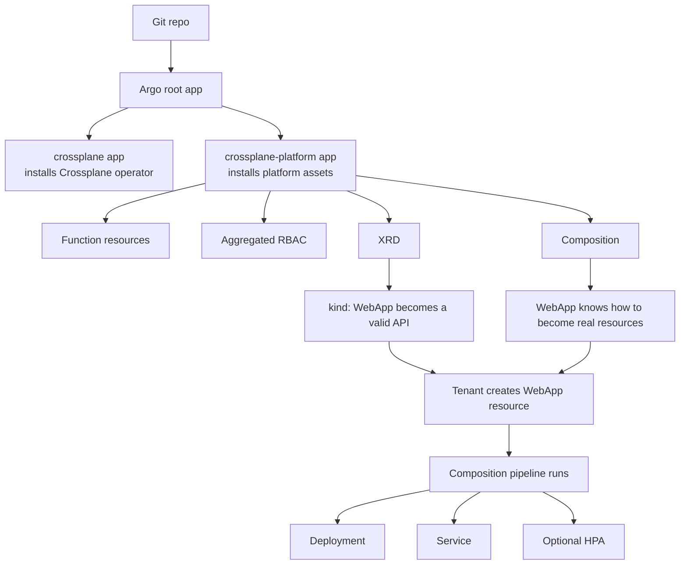
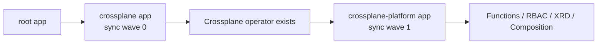
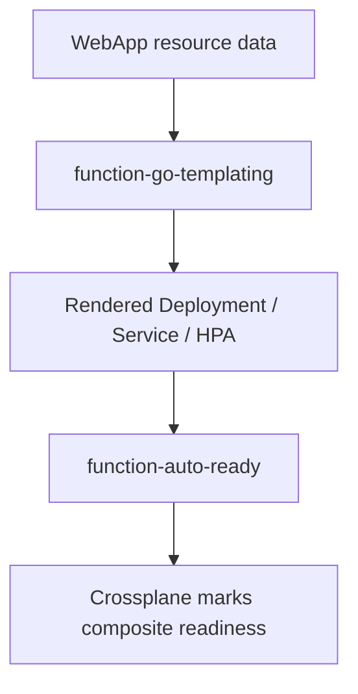
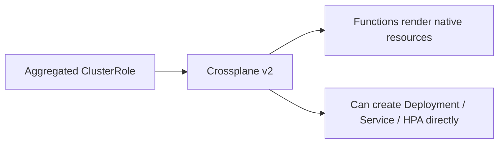
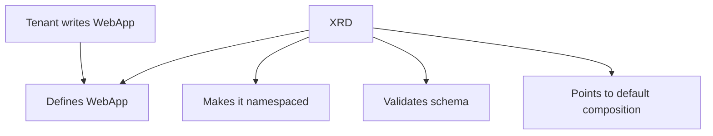
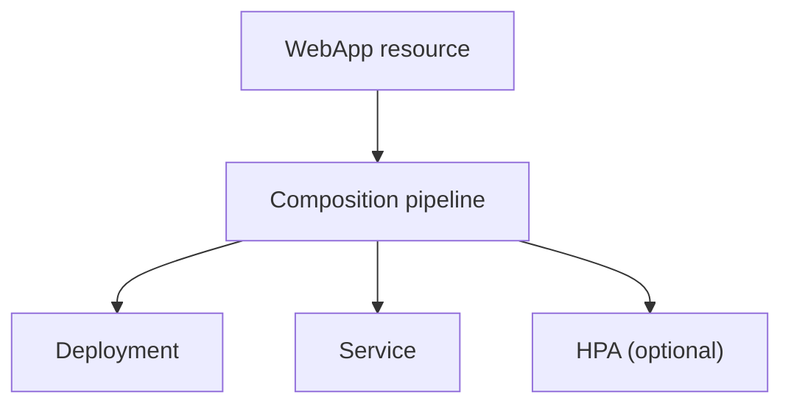
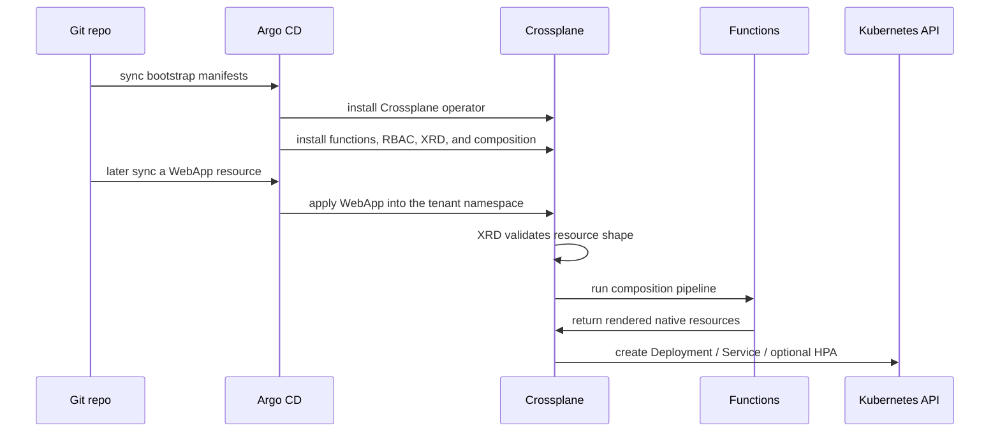

# Crossplane Resources Explained

This note explains the Crossplane resources added for the first `WebApp` platform API in beginner-friendly terms.

The main question it answers is:

What new machinery did we add so a future `WebApp` resource can become a real running app?

The answer is:

- we added the delivery path
- we added the composition functions
- we added the RBAC Crossplane needs for direct Kubernetes composition
- we added the platform API
- we added the implementation behind that API

## The Whole System First

Here is the full shape before we zoom into each file:



There are four layers here:

1. Argo CD delivery
2. Crossplane functions and permissions
3. The `WebApp` API definition
4. The implementation of that API

## 1. The Argo Delivery Layer

Files:

- [crossplane-application.yaml](/Users/riza.satyabudhi/Documents/workshop/claude/homelab/homelab-infra/clusters/homelab/bootstrap/crossplane-application.yaml)
- [crossplane-platform-application.yaml](/Users/riza.satyabudhi/Documents/workshop/claude/homelab/homelab-infra/clusters/homelab/bootstrap/crossplane-platform-application.yaml)

These are Argo CD resources, not Crossplane resources.

They exist because Crossplane needs to get its own manifests from Git into the cluster, just like anything else.

What each one does:

- `crossplane-application.yaml`
  - installs the Crossplane operator itself from the Helm chart
  - think of this as "install Crossplane the software"
- `crossplane-platform-application.yaml`
  - syncs the Crossplane platform assets from your repo
  - specifically:
    - `functions/`
    - `rbac/`
    - `xrds/`
    - `compositions/`
  - think of this as "install the things Crossplane should use"

This split matters because:

- the operator install is infrastructure plumbing
- the platform assets are your product logic

We also added sync waves so Argo brings up the operator before the platform assets.



Argo is the delivery truck. It gets Crossplane and Crossplane assets into the cluster.

## 2. The Function Layer

Files:

- [function-go-templating.yaml](/Users/riza.satyabudhi/Documents/workshop/claude/homelab/homelab-infra/platform/control-plane/crossplane/functions/function-go-templating.yaml)
- [function-auto-ready.yaml](/Users/riza.satyabudhi/Documents/workshop/claude/homelab/homelab-infra/platform/control-plane/crossplane/functions/function-auto-ready.yaml)

A Crossplane function is a helper used in pipeline-mode compositions.

In this repo:

- one function helps build the desired resources
- one function helps report readiness

### `function-go-templating`

This lets the composition render resources from a template.

Why we chose it:

- the `WebApp` API has optional autoscaling
- it has `env[]`
- it has `secretRefs[]`
- these are much easier to express in a template than in rigid patch-only logic

This function is the resource builder.

### `function-auto-ready`

This helps Crossplane determine when the composed resources are ready.

That improves the status of the higher-level Crossplane object, so readiness is less opaque.



## 3. The RBAC Layer

Files:

- [webapps-aggregate-to-crossplane.yaml](/Users/riza.satyabudhi/Documents/workshop/claude/homelab/homelab-infra/platform/control-plane/crossplane/rbac/webapps-aggregate-to-crossplane.yaml)
- [rbac README](/Users/riza.satyabudhi/Documents/workshop/claude/homelab/homelab-infra/platform/control-plane/crossplane/rbac/README.md)

This is the big Crossplane v2 difference from the earlier v1-style approach.

In Crossplane v2, a namespaced XR can compose native Kubernetes resources directly. That means we do not need `provider-kubernetes` `Object` wrappers for this `WebApp` API.

But Crossplane still needs permission to create those resources.

That is what the aggregated `ClusterRole` does:

- it grants Crossplane access to compose `Deployments`
- it grants Crossplane access to compose `Services`
- it grants Crossplane access to compose `HorizontalPodAutoscalers`

The critical label is:

```yaml
rbac.crossplane.io/aggregate-to-crossplane: "true"
```

That label tells Kubernetes RBAC aggregation to merge this role into Crossplane’s primary cluster role.

So the new v2 mental model is:



## 4. The XRD: Defining The API

File:

- [webapps.platform.rizaes.com.yaml](/Users/riza.satyabudhi/Documents/workshop/claude/homelab/homelab-infra/platform/control-plane/crossplane/xrds/webapps.platform.rizaes.com.yaml)

This file is the actual platform API definition.

XRD means `CompositeResourceDefinition`.

What it defines:

- API group: `platform.rizaes.com`
- version: `v1alpha1`
- kind: `WebApp`
- plural: `webapps`
- scope: `Namespaced`

This is the file that makes this object valid in the cluster:

```yaml
apiVersion: platform.rizaes.com/v1alpha1
kind: WebApp
```

This is a Crossplane v2-style XRD, so it uses:

```yaml
apiVersion: apiextensions.crossplane.io/v2
```

It also defines the schema, meaning what fields are allowed and required.

The important fields are:

- `spec.image`
- `spec.port`
- `spec.host`
- `spec.owner`
- `spec.resources.requests`
- `spec.resources.limits`
- optional `spec.secretRefs[]`
- optional `spec.env[]`
- optional `spec.autoscaling`

Unlike the legacy v1-style model:

- there is no separate claim kind
- there is no `XWebApp` internal kind you need to care about
- the namespaced `WebApp` resource is the thing the tenant writes



This file is the contract.
It is the answer to: what does the platform expect a web app request to look like?

## 5. The Composition: Implementing The API

File:

- [webapps.platform.rizaes.com.yaml](/Users/riza.satyabudhi/Documents/workshop/claude/homelab/homelab-infra/platform/control-plane/crossplane/compositions/webapps.platform.rizaes.com.yaml)

If the XRD is the interface, the Composition is the implementation.

This file answers:
When someone creates a `WebApp`, what exactly should happen?

Important version note:

- the XRD uses `apiextensions.crossplane.io/v2`
- the Composition still uses `apiextensions.crossplane.io/v1`

That is the correct Crossplane v2 setup.

In this repo, the Composition:

- runs in pipeline mode
- calls `function-go-templating`
- renders native Kubernetes resources directly
- then uses `function-auto-ready`

This is where the real workload shape lives.

### What It Renders

The composition creates:

- one `Deployment`
- one `Service`
- one `HorizontalPodAutoscaler` if autoscaling exists

It does not compose a `Namespace`.

That is intentional in the v2 design here:

- Argo CD creates the tenant namespace through its existing `CreateNamespace=true` behavior
- the `WebApp` resource lives in that namespace
- Crossplane composes the workload resources into that same namespace

### What It Maps From The Resource

It takes data from the `WebApp` resource and pushes it into those resources:

- `metadata.name` becomes the deployment and service name
- `metadata.namespace` becomes the namespace for all composed resources
- `spec.image` becomes container image
- `spec.port` becomes container and service port
- `spec.resources` become container requests and limits
- `spec.env[]` becomes plain env vars
- `spec.secretRefs[]` becomes `secretKeyRef` env vars
- `spec.owner` becomes labels and annotations
- `spec.host` becomes metadata annotations only
- `spec.autoscaling` controls whether an HPA is rendered

We also inject OTEL defaults in the deployment so the platform owns those shared observability settings.



## 6. Sync Waves And Why They Matter

We added sync-wave annotations in several places.

Why:

- the Crossplane operator must exist before platform assets are useful
- the functions and aggregated RBAC should exist before the XRD and composition start reconciling
- the XRD should exist before the composition is really useful

This is not the business logic, but it is important operational glue.

Without ordering, GitOps systems often fail the first sync and only recover on the second.
The sync waves reduce that friction.

## 7. The Documentation Files

Files:

- [2026-04-04-idp-8-webapp-platform-api.md](/Users/riza.satyabudhi/Documents/workshop/claude/homelab/homelab-infra/docs/2026-04-04-idp-8-webapp-platform-api.md)
- [crossplane README](/Users/riza.satyabudhi/Documents/workshop/claude/homelab/homelab-infra/platform/control-plane/crossplane/README.md)
- [providers README](/Users/riza.satyabudhi/Documents/workshop/claude/homelab/homelab-infra/platform/control-plane/crossplane/providers/README.md)
- [functions README](/Users/riza.satyabudhi/Documents/workshop/claude/homelab/homelab-infra/platform/control-plane/crossplane/functions/README.md)
- [rbac README](/Users/riza.satyabudhi/Documents/workshop/claude/homelab/homelab-infra/platform/control-plane/crossplane/rbac/README.md)
- [xrds README](/Users/riza.satyabudhi/Documents/workshop/claude/homelab/homelab-infra/platform/control-plane/crossplane/xrds/README.md)
- [compositions README](/Users/riza.satyabudhi/Documents/workshop/claude/homelab/homelab-infra/platform/control-plane/crossplane/compositions/README.md)

These are not runtime pieces, but they matter a lot because Crossplane has many moving parts and gets hard to reason about fast.

## The Entire Story In Sequence



## The Simplest Translation Of Each Resource Type

If you want the shortest beginner mapping:

- Argo `Application`
  - "make sure these Git files exist in the cluster"
- Crossplane `Function`
  - "helper logic used during composition"
- aggregated `ClusterRole`
  - "give Crossplane permission to compose native Kubernetes resources"
- Crossplane `CompositeResourceDefinition`
  - "define the new platform API and its schema"
- Crossplane `Composition`
  - "implement what that API creates"

## What Changed Conceptually In The Repo

Before this work:

- Crossplane existed
- but it had no platform API
- tenant apps were still raw Kubernetes YAML

After this work:

- Crossplane has the machinery to define and implement `WebApp`
- the repo now has a real platform API contract
- the next tenant migration can replace raw runtime YAML with a namespaced `WebApp` resource

That is the real shift:
from "Crossplane is installed" to "Crossplane can now act as the platform."

## What People Usually Mean By "Crossplane Plugins"

"Crossplane plugins" is not really the main official mental model, so it is easy to get mixed up.

In practice, people usually mean one of these:

- providers
- functions
- configurations

The cleanest way to think about it is:

- `Provider`: extends Crossplane with the ability to manage some kind of external or managed resource
- `Function`: extends Crossplane’s composition pipeline with logic
- `Composition`: not a plugin, but your implementation blueprint
- `XRD`: not a plugin, but your API definition
- `Configuration`: a bundle or package that can ship XRDs, Compositions, and dependencies together

For this repo’s current `WebApp` API:

- the active extension point is functions
- the direct Kubernetes composition path uses aggregated RBAC instead of `provider-kubernetes`
- the `WebApp` XRD is the API contract
- the `WebApp` composition is the implementation
